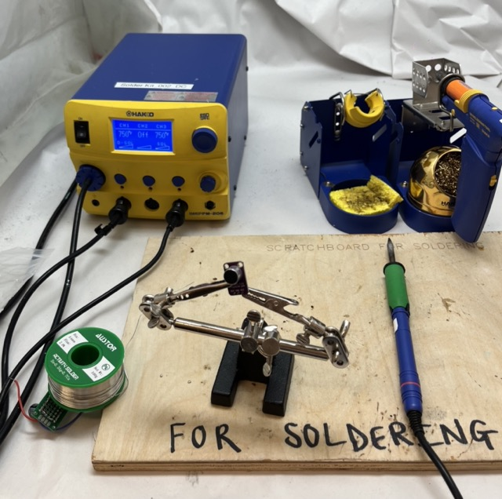
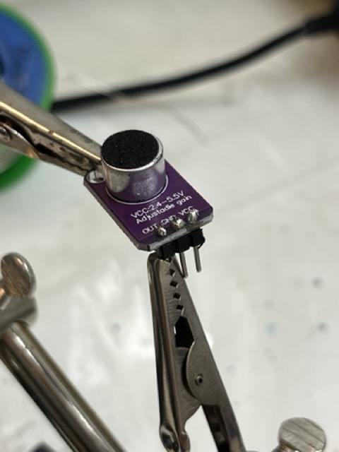
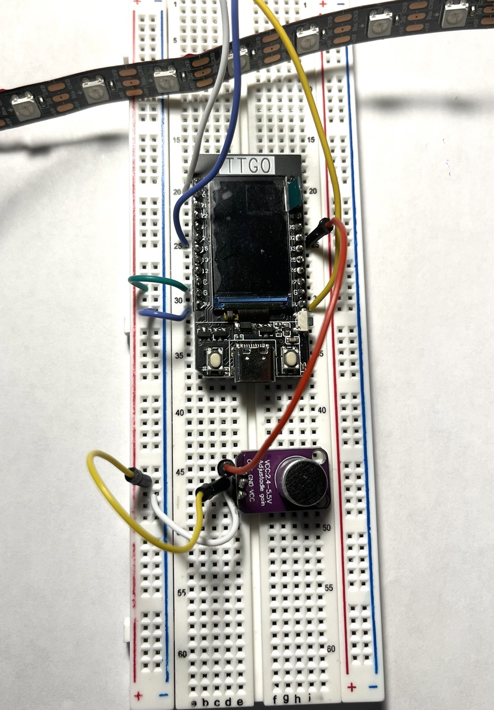
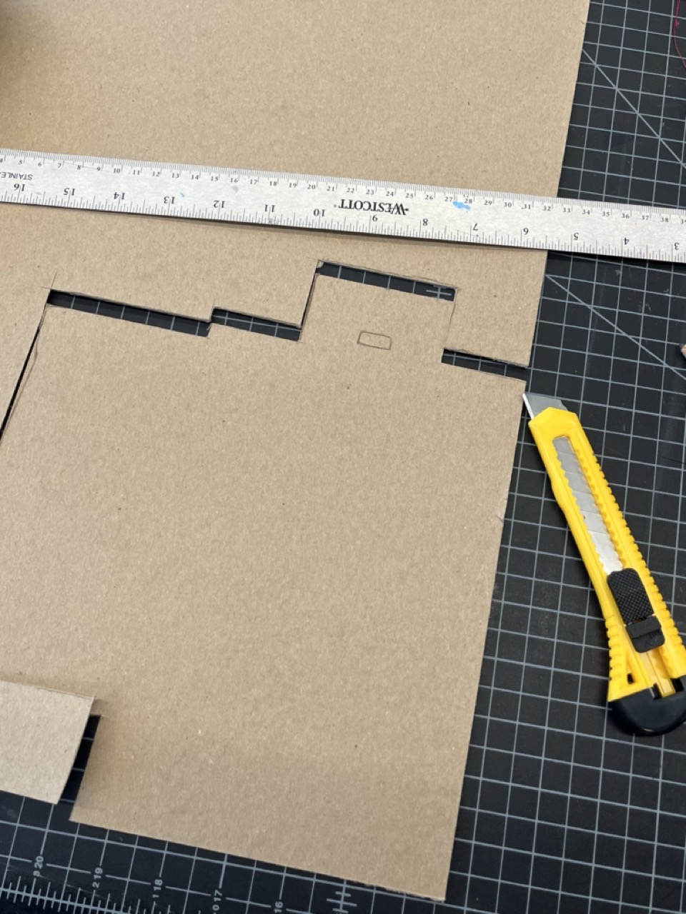
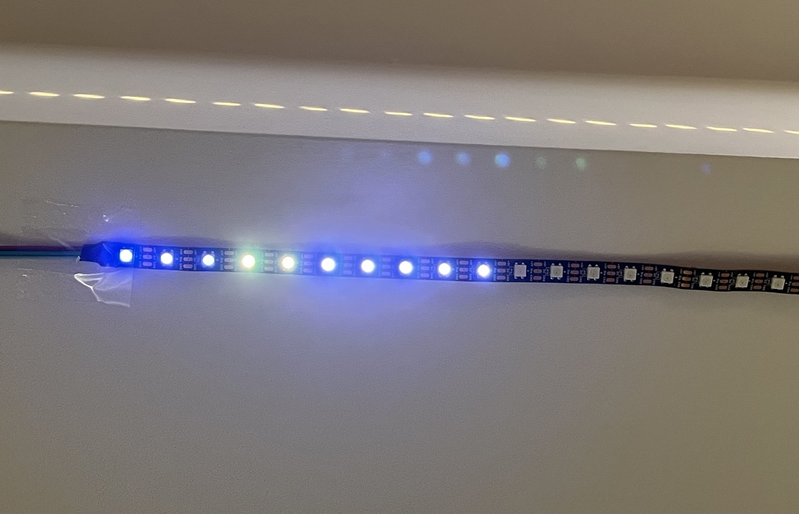

## TECHNICAL GUIDE: ***Create your own SOUND REACTIVE LED***

*[click here for the github repository](https://github.com/Amandaaa00/Watching_the_Sound)*

## Hardware components:

- ESP32 TTGO T-Display
- Microphone: MAX4466
- LED Strip (30 LEDs in total)
- Breadboard

## Top-level procedures:

- Use microphone to capture sound
- Transform them into electrical signals
- Processed by the microcontroller, ESP32
- Transfer the electrical signals to LEDs
- Display the sound on LEDs through different colors and change of colors

# ~~Detailed Steps~~~

## Connecting Wires

1. Solder the jump wires to the Microphone
    
    *[Soldering Preparation]*
    
    
    

*[After Soldering]*

1. Microphone MAX 4466:
    1. Connect OUT to the input pin chosen (Pin 32) to ESP32
    2. Connect VCC to the 3V pin of ESP32
    3. Connect GND to the Ground pin of ESP32
2. LED strip: 
    1. Connect +5V to the 5V pin of ESP32
    2. Connect GND to the Ground pin of ESP32
    3. Connect Din to the pin 2 of ESP32
3. Special Attention:
I connected the Microphone to ESP32 using indirect wiring, as I connected the VCC pin and GND pin to the side columns of the breadboard and connect the corresponding columns of the breadboard to the pins of ESP32. 
    
    I encoutered difficulties that when I directly connect GND to the Ground pin of ESP32, it seems that it will make the ESP32 in short circuit, with the Arduino showing that the board is disconnected.
    
    *[Final Wiring]*
    
    
    

## Writing the Arduino Code

I installed the Freenove_WS2812_Lib_for_ESP32.h library, which is very useful for LED displays. I created the strip object in the beginning and set several variables such as the MicVolume, and the delay interval. And then in the setup, I initiated the strip object and set the brightness, I also assign the serial baud specifically as 9600, which is where I will read the input values of microphone from.

Then, in the loop function, I take the analog input from the microphone and print it out to serial. Afterwards, I divided the LED strip equally into three segments, and write if else statements for each of the segments corresponding to different levels of the sound input. For each segments, I firstly set all the LEDs to black, and then set the corresponding segemnt of LED strip to an assigned color by looping over every light in that segment. Then I added a delay to after the show function of the strip.

Through multiple times of testing and optimizing, I chose the values for the sound intervals, delay intervals, segment LED colors, and brightness that can display the best effect in repond to music or sound changes.

## Build a Minimal Design Enclosure

1. Use hard board paper and cut them into appropriate size
    
    
    
2. Cut out the space left for type C USB wires to connect to ESP32
3. Fold the board paper into a box with a ruler and stick the connections
4. Write the Knock Me text and draw some cute decorations and musical notes to correspond to the objectives

## Technical Difficulties Encountered

### 1. Soldering

I was new for soldering, so I found it pretty hard to solder well. I was worried that the low-quality soldering might cause the hardware to be in short circuit or in poor connection. I practiced soldering for several times and looked for tutorials to do it better.

### 2. Connecting the wires

I struggled for quite a long time facing the situation that when connecting the GND pin of microphone to the ground pin of ESP32, it would make ESP32 in short circuit and disconnected to Arduino. Then I figured out the situation by connecting VCC andd GND pins of the microphone to side columns of the breadboard, and then connect the corresponding columns to the 3V and Ground pin of the ESP32. There becomes no longer any short circuiting problems.

### 3. LED powering

I originally chose a very long and water proof LED strip, which has about 300 LEDs on it. This LED strip can’t be lighten through connecting to ESP32. I think this might be because of insufficient power supply. An external power supply might be needed to connect to the LEDs. I used a shorter LED strip of 30 LEDs instead.

### 4. LED display

During the testing of the LED programming, I wanted to use a rainbow color for the whole LED strip, but it turned out that this might not be appropriate and convenienct to change the colors quickly and responding to the sound, as there are too many loops for the rainbow colors to display. Therefore, I chose a single color for each segment instead.

Also, the LEDs always flash which make it uncomfortable to see. I tried to improve the flashes through adding reasonable delay intervals, and chaning the sound ranges to be more stable ranges that the sound might trigger. However, there are still rooms to improve the flash problem, as flash happens every looping process.

### 5. Color Arrangement

I used Serial.pintln to print indicators of the sound intervals of low, medium and high. And this somehow made the colors assigned to each segment to be distributed well for the segments. Without this printing function, the LED lights would only display in the third segment no matter in what sound interval, and the colors seem to mix together.

